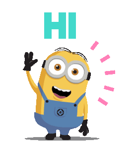
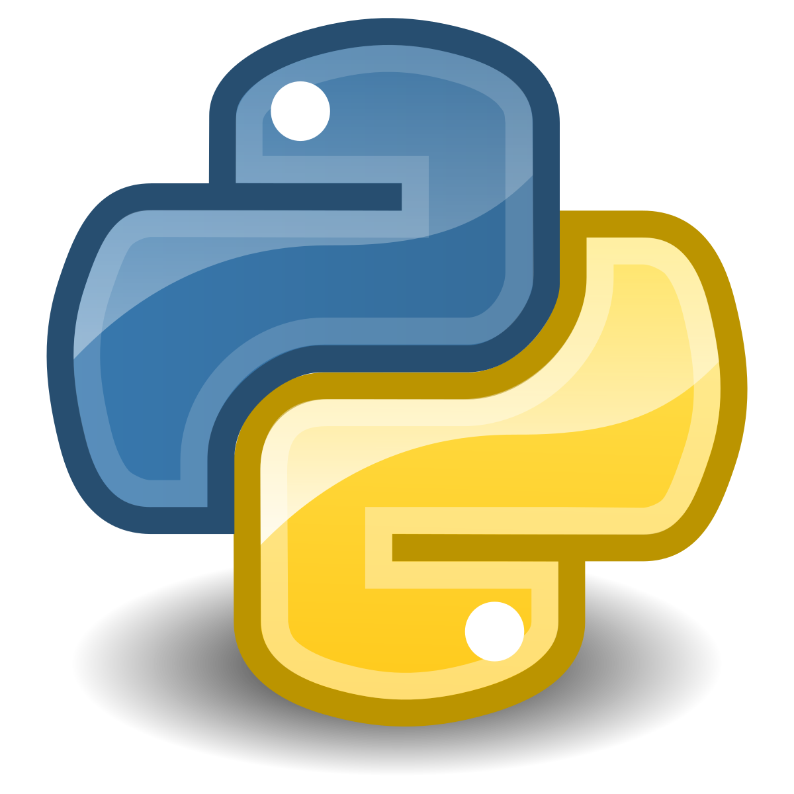

<h1><code>// I am Kuvam Bhardwaj</code></h1> 

Hey there visitor !
I am a <b>MERN stack developer</b> 👨🏻‍💻 from India 🇮🇳 and I love to code, debug 🐞 & ship some real projects 🚀. Always on some project, <b>I love to collaborate and brainstorm</b> 🔥. Want to collaborate? try options given at the end ;)</b>    

<h2><b>I like:</b></h2>

<ul>
    <li>Learning beautiful technologies 🥰</li>
    <li>Web development & IOT 🚀</li>
    <li>Mathematics behind machine learning ✨</li>
    <li>Mentoring people ❤️</li>
    <li>Telling people that java & javascript aren't same 😅</li>
</ul>

<h2><b>Instruments I Use:</b></h2> 

  

     

